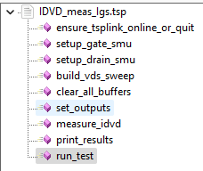
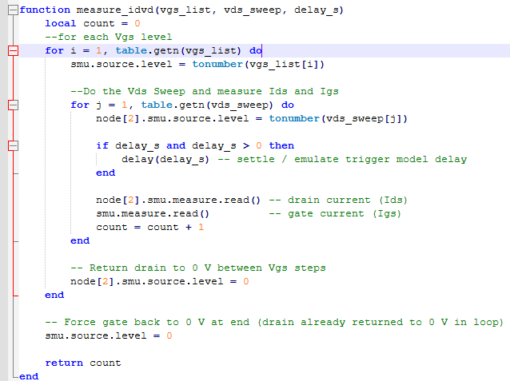
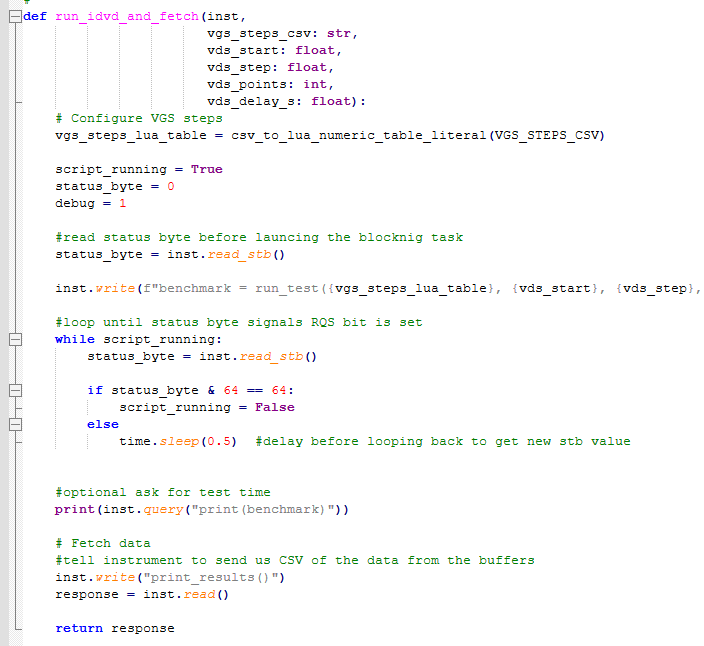
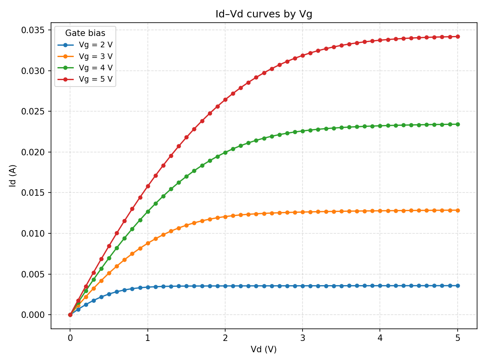

# Load and Run TSP code from Python

This directory holds a code example for loading TSP
functions from a TSP file and then using them from Python.
Typically, the TSP file is written/debugged/tested using TSP Toolkit.

The example performs an IDVD on MOSFET using two 2450 SourceMeter.
It also measures the gate leakage current for each Vds-Ids point.

Consult 2450 User Manual for DUT connection and TSPLINK Node number configurations.

Computer running Python connects to node 1 = Gate
TSPLINK to node 2 = Drain

## Directory

[comment]: **[Instrument](./directory)**  

* **[TSP Function Defining](./IDVD_meas_Igs.tsp)**  
This TSP file defines some helper functions.  You only need to load the functions
into the 2450 runtime memory once per session.  If you reboot the 2450, then load it again.

* **[Python for loading and Using TSP Functions](./run_IDVD_meas_Igs.py)**  
This Python shows how to load a script from a tsp file and then make use of the functions.
The TSP will cause the instrument to assert SRQ at test completion.
The Python shows how to loop on the status byte (VISA Read_STB()) until SRQ is detected.
Then it asks for the data, places it into a dataframe and plots IDVD.

## Code Walk Through

The Defining file contains instrument commands orgainized into functions.
When this file is run on the 2450, it loads the functions into runtime memory.
The actual IV test will not be performed until you call your run_test() function.
These functions are essentially your API for the task you need the 2450 to do.

Below is some detail of one of the functions.  It is defined to use paramters.
For example, the voltage levels for the gate and drain are passed in table variables.
Also a parameter for some sweep delay has been defined.
The IDVD family of curves is carried out by nested for/next loops that run
in the TSP runtime engine on the 2450 instruments.  This results in fast test time.

Below is part of the Python code.  In this case, we have defined a Python function that will 
run the test and fetch the results at test completion.
The VISA write are invoking the TSP functions to carry out the test.

Below shows the outcome for IDVD on SD210 nFET

The TSP code can also be run from TSP Toolkit extension for VSCode.
In this case, the data results can be spooled to the Terminal window of TSP Toolkit.

